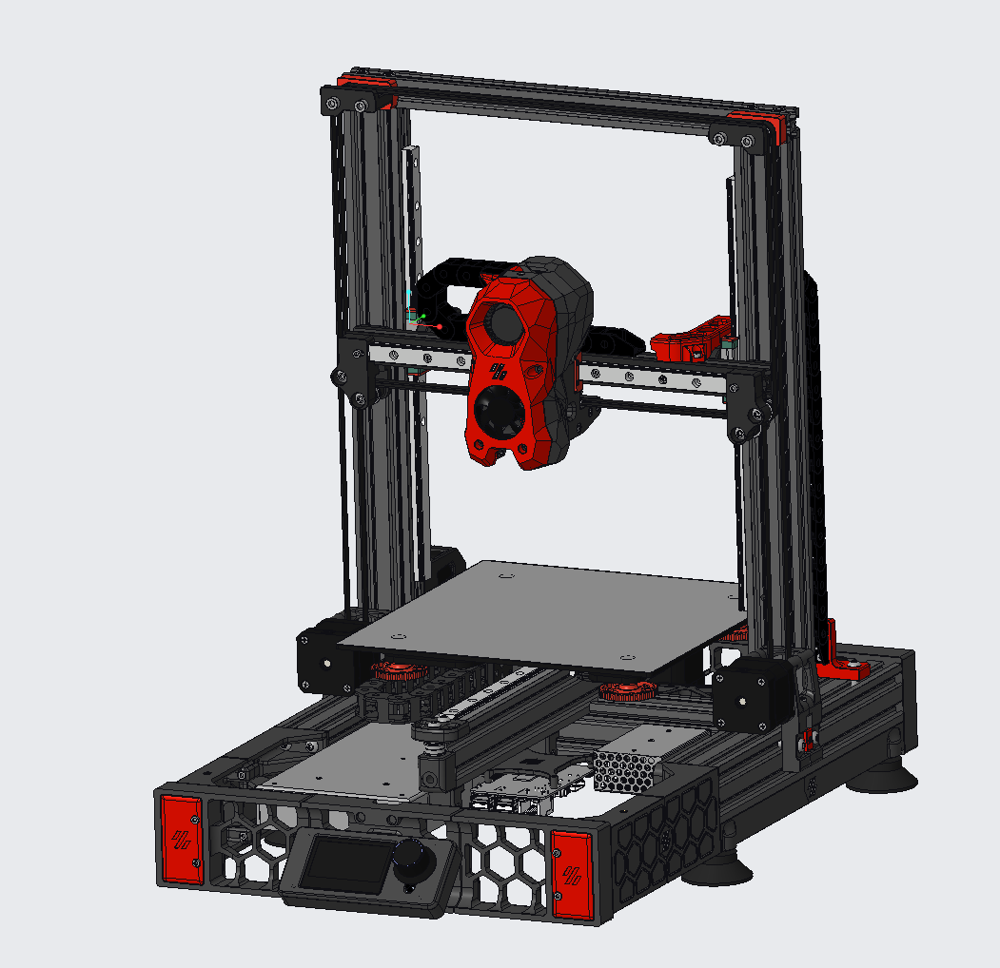

# enderwire_nonpro

Based on Gizzles Y-Axis https://github.com/VoronDesign/VoronUsers/tree/master/printer_mods/Gizzle/ender-3_(pro)_switchwire
And DarkDogs Rev2 https://github.com/boubounokefalos/Ender_SW/tree/Rev.2

Modified Skirt to hold PSU.
Modified Rear Grill to have some adjusted for belt tightening.
Location of Pi to the front.
Panels not incluced yet, may comes in the future.
Still thinking of way to connect the y-axis to the front grill.

