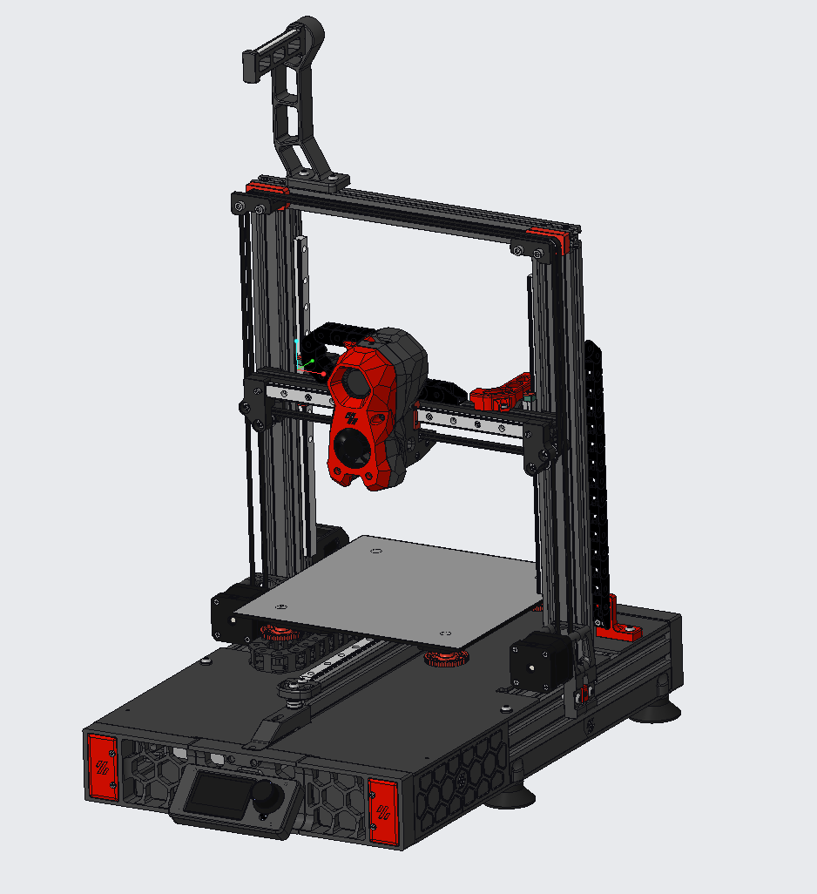
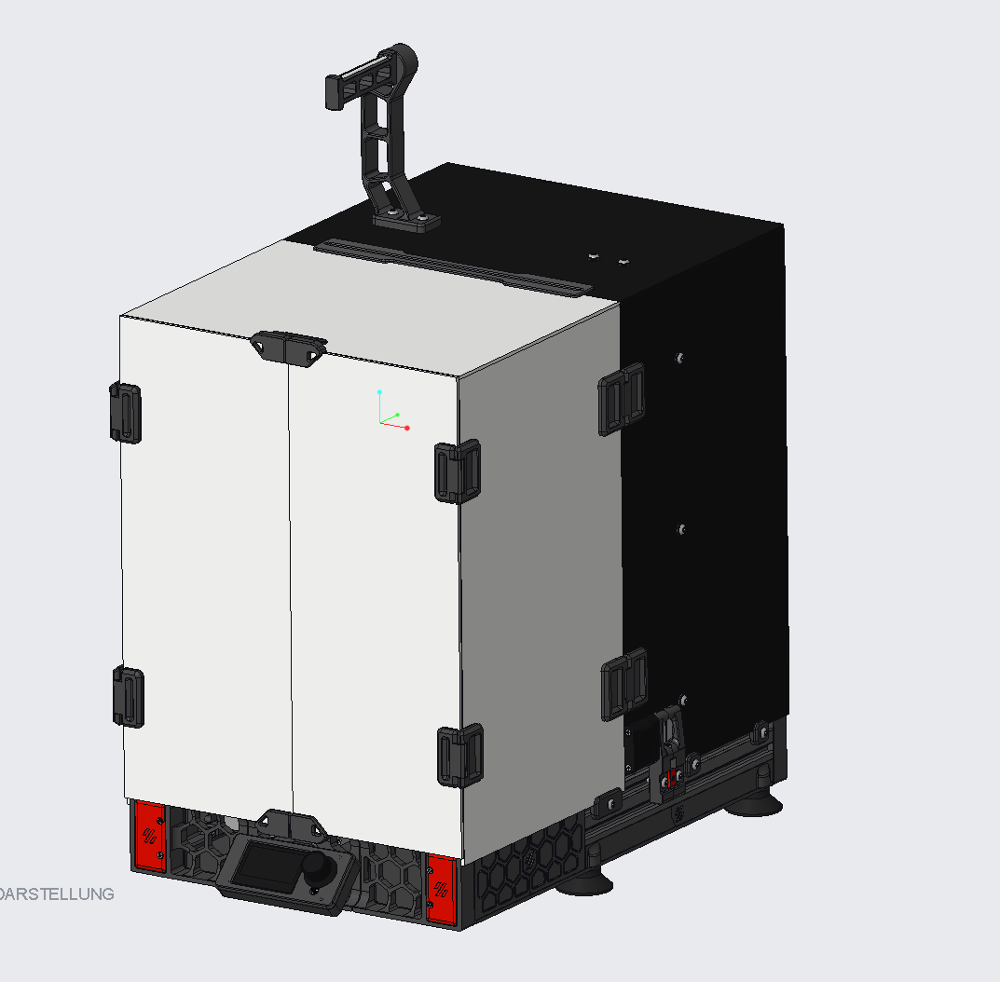

# enderwire_nonpro

This is a collection of parts to fit the Gizzle Y-Axis for the Standard Ender with 2040 Y Extrusion to fit the DarkDog Rev2 Ender_SW.

Based on Gizzles Y-Axis https://github.com/VoronDesign/VoronUsers/tree/master/printer_mods/Gizzle/ender-3_(pro)_switchwire
STLs: https://github.com/VoronDesign/VoronUsers/tree/master/printer_mods/Gizzle/ender-3_(pro)_switchwire/STL/Y-ASSEMBLY
 - Replace "Y-Idler-Bottom" with my "y_idler_lower_part" and use "front_y_grill_connection" to connect idler to front grill.

And DarkDogs Rev2 https://github.com/boubounokefalos/Ender_SW/tree/Rev.2
STLs: https://github.com/boubounokefalos/Ender_SW/tree/Rev.2/STLS
- Use my "rear_grill_middle"
- Use my "rear_extention_left_a_psu.stl" instead of "rear_extention_left_a.stl"
  Works also as PSU Holder (No need for "PS_4040_Slide_Mount.stl")
- Use my "upper_deck" (for both sides) and "rear_panel"

There are mounts for the original PSU, also use the extension_left_a_orig_psu.stl then instead.
With original PSU is the thick non-meanwell psu meant.
It is advisable to not use a lower panel then(or create a cutout), as the psu fan is very close to the panel.

Overview of changes:

- Y-axis extrusion moved forward with replacing the M5 bolts with shorter ones and using t-nuts in the extrusion.
  35mm bolts are bit too long depending on how the extrusions are machined, so use some washers under the bolt head till the bolts 
  does not hit the bottom of the extrusion.
- Modified Skirt to hold PSU, added Parts when using original PSU.
- Modified Rear Grill to have some room (a few Millimeters) for belt tightening.
- Located of Pi to the front.
- Connected front idler mount to frame.
- There is no belt tensioner, use the rear motor mount to tension the belt (Same as Switchwire)

TBD:

-Create Table which files replace which files for better understanding

